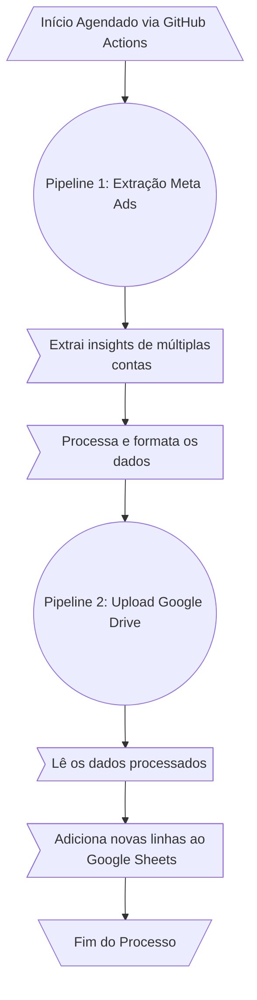

# Pipeline de Automação de Relatórios de Marketing

Este repositório contém um pipeline de dados totalmente automatizado, projetado para extrair insights de performance de campanhas do **Meta Ads** e consolidá-los de forma incremental em uma planilha centralizada no **Google Sheets**.

## Objetivo do Projeto

O objetivo final deste pipeline é criar uma fonte de dados robusta, centralizada e sempre atualizada no Google Sheets.

Esta planilha serve como a base para alimentar dashboards e relatórios interativos no Looker Studio, permitindo o acompanhamento de performance das campanhas de forma visual e acessível para os clientes.

## Funcionalidades Principais

  - **Extração de Múltiplas Contas:** O sistema é capaz de se conectar a diversas contas de anúncio do Meta e extrair dados de forma consolidada.
  - **Performance Assíncrona:** Utiliza chamadas assíncronas à API do Meta para otimizar o tempo de extração de dados, processando várias solicitações em paralelo.
  - **Processamento de Dados:** Transforma os dados brutos da API, incluindo o tratamento e a dinamização de métricas complexas como `actions` (ações), para um formato analítico tabular.
  - **Armazenamento Incremental:** Os dados semanais são **adicionados** à planilha do Google Sheets, preservando todo o histórico de performance e evitando a sobreposição de informações.
  - **Agendamento Automático:** O pipeline é executado automaticamente em uma frequência semanal, garantindo que os dados estejam sempre atualizados sem qualquer intervenção manual.

## Estrutura do Projeto

O repositório está organizado da seguinte forma para separar as responsabilidades e configurações:

```
.
├── .github/
│   └── workflows/
│       └── executar_pipeline.yml     # Arquivo de automação do GitHub Actions
├── .gitignore
├── LICENSE
├── meta_ads_script.py                # Pipeline 1: Extração e processamento dos dados do Meta
├── README.md
├── requirements.txt
└── upload_relatorio_gdrive.py        # Pipeline 2: Upload para o Google Sheets
```

## Tecnologias Utilizadas

  - **Linguagem:** Python 3.13
  - **Bibliotecas Principais:**
      - `pandas`: Para manipulação e processamento de dados.
      - `facebook-business`: SDK oficial para interação com a API do Meta Ads.
      - `gspread`: Para interação com a API do Google Sheets.
  - **Automação e CI/CD:**
      - `GitHub Actions`: Para o agendamento e execução automática dos pipelines em ambiente de nuvem.


## Fluxo de Trabalho do Pipeline

A automação é dividida em dois estágios principais que rodam em sequência, garantindo a modularidade e a robustez do processo.



## Agendamento

A automação é configurada para ser executada semanalmente, **toda sexta-feira**, através do orquestrador do GitHub Actions, garantindo a consistência e a pontualidade na entrega dos relatórios.

-----
